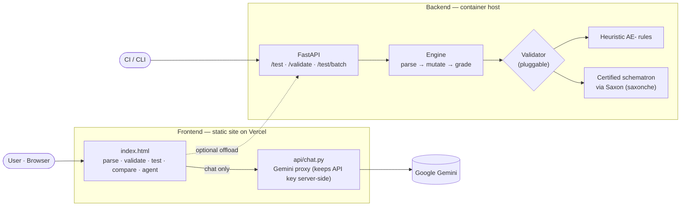

# InvoiceFlow

A workspace for **UAE PINT-AE e-invoices**. Load a UBL invoice and InvoiceFlow
renders it as a human-readable document, decodes every field, validates it against
PINT-AE rules, generates a suite of test scenarios that deliberately break it to
prove the validator works, compares invoices side by side, and answers questions
through a built-in assistant that can also operate the app for you.

The project has **two parts**:

1. **Frontend** — a self-contained web app (one `index.html`) plus a tiny chat
   proxy. All invoice processing runs in the browser; only chat messages leave the
   device. Deploys as a static site on Vercel.
2. **Backend** — a Python *test-runner* service that performs the same scenario
   suite server-side, exposes it over HTTP and a CLI for CI/batch use, and can
   grade against the **certified PINT-AE schematron**. Deploys as a container.

Both share one scenario concept and run the same ~23-scenario suite, built to
agree (23/23 on the reference invoice), so what you see in the browser matches what
CI enforces.

---

## Why this exists

The UAE is rolling out mandatory e-invoicing (phased through 2026–2027). Invoices
become structured **UBL XML** exchanged over the **Peppol** network through
accredited service providers (ASPs), validated against a **schematron** rulebook,
with tax data reported to the Federal Tax Authority (FTA). Raw PINT-AE XML is hard
to read and harder to debug. InvoiceFlow makes it legible, checkable, and testable.

> **Important:** InvoiceFlow's built-in checks (rule IDs prefixed `AE-`) are
> *heuristic stand-ins* that imitate common PINT-AE rules for early feedback and
> learning. They are **not** the official accredited schematron. The backend can
> be pointed at the real ruleset (see below); always validate against the
> certified validator before going live.

---

## Architecture



**Design choice — client-heavy.** Parsing, validation, test generation, comparison,
and exports all run in the browser, so the app keeps working with no server. The
*only* thing that needs a backend in the frontend deployment is the chat, because
it must hold an API key secretly. The **test-runner backend** is a separate,
optional service for automation and certified validation.

---

## Repository structure

This is a **monorepo on `main`** — frontend and backend files sit together at the
repository root:

```
api/
  chat.py                      # FRONTEND — Gemini chat proxy (Python serverless, stdlib only)
app/
  engine/
    parse.py                   # BACKEND — namespace-agnostic UBL parser (lxml)
    rules.py                   #   heuristic AE- validator (+ RULE_KB, verdict)
    scenarios.py               #   scenario catalogue, XML mutation, grading
    schematron.py               #   optional certified-ruleset validator (Saxon)
    __init__.py                #   select_validator()
  api.py                       #   FastAPI app
  cli.py                       #   command-line runner
  report.py                    #   JUnit + CSV serialisers
  samples/                     #   good.xml, bad.xml (identical to the frontend's)
tests/                         # BACKEND — pytest: engine + API
Dockerfile                     # BACKEND
requirements.txt               # BACKEND
run.sh                         # BACKEND
index.html                     # FRONTEND — the entire app (no build step, no framework)
vercel.json                    # FRONTEND — function config
README.md
```

Frontend and backend deploy to two different hosts from this **same** repo (see the
two Deploy sections below), so each host is pointed only at the files it needs —
via `.vercelignore` on the frontend side and `.dockerignore` on the backend side —
rather than a subfolder split. If the mix of Python backend files sitting next to
the static frontend ever gets confusing, the alternative is to split into
`invoiceflow/` and `invoiceflow-backend/` subfolders and point each host's **root
directory** setting at its own subfolder instead; either layout works, this is
just the one currently in the repo.

---

## Part 1 — Frontend web app

### Layout — a ribbon workbench

The UI is organised like a CAD workbench: a top **ribbon** of three sections, each
opening a **toolbar row** of sub-tools beneath it. Each section remembers the last
tool you used. Invoices are managed in the left rail (drop / browse / samples), the
open invoice fills the canvas, and the grounded **Assistant** sits on the right.

**Appearance.** A sun/moon toggle in the top bar switches between **dark mode**
(the default — dark chrome with a light document canvas) and **light mode** (the
chrome relightens to match the canvas, for a fully bright look). The choice is
saved in the browser and restored on return, applied before first paint so there's
no flash of the wrong theme.

**1 · Invoice** — get an invoice in and read it.

| Tool | What it does |
|---|---|
| **View** | Renders the XML as a clean, printable invoice (Print / Save as PDF). |
| **Details** | Decoded data with each field tagged by its business-term code (BT-1, BT-110…) per the schematron: parties, **transaction type** (BTAE-02), VAT breakdown, totals, line items. Export decoded JSON or lines CSV. |

**2 · Inspect & Test** — check the invoice and prove the checks.

| Tool | What it does |
|---|---|
| **Validation** | Verdict (accepted / warnings / rejected) with a status ring and a pass·warning·fatal meter; each issue shows severity, rule ID, explanation, and fix. Includes **combination/category rules** (e.g. `ibr-122-ae`, `ibr-151-ae`, `ibr-116-ae`, `ibr-103-ae`, `ibr-120/121-ae`) covering document-type × transaction-type × VAT-category constraints. **Edit invoice** opens the underlying XML in an inline editor with a live well-formedness indicator, for manual corrections the automated fixes can't make — save in place to re-parse and re-validate the same invoice, or *Save as copy* to keep the original and diff the two in Compare. **Auto-fix** applies safe corrections automatically; an **engine toggle** switches between the built-in heuristics and a backend schematron. Download an HTML report or export findings as JSON/CSV. |
| **Test Scenarios** | ~23 scenarios that each inject one fault, grouped by category (Identity, Temporal, Parties, Tax, Currency, Totals, Structure, **Combinations**, Baseline), with a results donut, a *valid → fault → rule fires* flow, live pass/fail icons, a before→after XML diff, batch runs across all invoices, and JSON / JUnit export. Three transparency layers sit on top of the run itself: a **traceability matrix** (every built-in rule cross-referenced with the scenario that proves it, so an unproven rule is visible instead of hidden inside a coverage percentage); a **confusion-matrix reliability summary** — true/false positive/negative counts with recall, precision, and accuracy, computed per run and explicit about its own sample size; and a **run ledger** (saved in the browser) logging every run's timestamp, invoice(s), and pass rate, exportable as JSON. |

**3 · Tools** — creation, conversion, and multi-invoice work.

| Tool | What it does |
|---|---|
| **Convert** | Turns an uploaded invoice — **any format** — into downloadable PINT-AE XML. **XML**, **JSON**, **CSV**, and **Excel (.xlsx/.xls)** convert deterministically in the browser (Excel is read via SheetJS and mapped like a CSV table); **Word (.docx)**, PDF text, and pasted plain text are extracted (via mammoth.js / pdf.js) and then structured with the AI assistant, flagged for review. Download the XML, print a readable copy, or load it into the workspace. Scanned/image PDFs aren't supported — that needs OCR. |
| **Compare** | Two invoices side by side in a **complete field-by-field diff**, grouped into sections — document header, seller, buyer, per-category tax breakdown (aligned by category), every allowance/charge, every line item (aligned by position), and monetary totals (with deltas) — plus a validation comparison showing which rule IDs each raises and which are shared. Changed rows are highlighted and tagged; a **Differences only** toggle hides everything that matches, and the whole diff exports to CSV. |
| **Batch** | Every loaded invoice in one pass/fail table with fatal/warning counts, combined JSON/CSV export, and a run-all-scenarios sweep. |

The grounded **Assistant** is available throughout: it answers questions about the
open invoice **and** operates the workbench (open tools, generate/run tests, add
variants, load samples), showing what it did inline.

The workspace (invoices, active tool, chat) is **saved in the browser** and restored
on return; a **Clear workspace** button wipes it. A **Private** badge reflects that
everything but chat stays local.

### Chat proxy (`api/chat.py`)

A Vercel Python serverless function using only the standard library (no
dependencies). It accepts `{ system, messages }`, maps them into Google Gemini's
format, disables Gemini 2.5 "thinking" (so replies aren't empty), and returns
`{ reply }`. The Gemini API key is read from an environment variable and never
reaches the browser.

### Deploy (Vercel)

1. Import this repo in Vercel — root directory stays the default (`/`), since
   `index.html`, `api/chat.py`, and `vercel.json` are already at repo root.
2. Add a **`.vercelignore`** at repo root listing the backend-only paths, so Vercel's
   zero-config detection doesn't get confused by a top-level `requirements.txt` /
   `Dockerfile` sitting next to the frontend, and doesn't upload files it doesn't need:
   ```
   app/
   tests/
   Dockerfile
   requirements.txt
   run.sh
   ```
   No build command needed either way — it's a static site + a Python function.
3. **Settings → Environment Variables** → add `GEMINI_API_KEY` (from Google AI Studio / Google Cloud).
4. **Redeploy** (env vars only apply to a fresh deploy).
5. Test with a real chat message. Visiting `/api/chat` should return
   `{"status":"InvoiceFlow chat endpoint. Use POST."}`.

> The app degrades gracefully: if the chat backend is absent or the key isn't set,
> the assistant falls back to built-in answers and every other feature still works.
> No `requirements.txt` is needed — the proxy is pure standard library.

---

## Part 2 — Backend test runner

Its job is to **run the PINT-AE test scenarios** anywhere a browser can't: in CI,
in batch, or against the certified rules.

### How it works

For each invoice: parse the UBL XML → generate the scenarios → each `mutate()`
re-parses a *fresh* copy and injects one fault (delete the ID, blank a VAT rate,
duplicate an allowance reason, corrupt a total…) → validate the mutant → grade
(the expected rule must fire; the positive "control" must pass). Because every
mutation starts from a clean copy, scenarios never contaminate each other.

### Pluggable validator

`select_validator()` chooses automatically:

- **Heuristic** (default) — the same `AE-` rules as the browser, so results match.
- **Certified schematron** (optional) — install `saxonche` and set
  `PINT_SCHEMATRON_XSLT` to the official ruleset compiled to an SVRL-producing
  XSLT. Validation then runs the real rules via Saxon (no JVM). Since certified
  rule IDs differ from `AE-` IDs, negatives are graded as "the mutation made the
  invoice invalid" and the positive control as "nothing fatal fired".

### HTTP API

| Method & path | Body | Returns |
|---|---|---|
| `GET /health` | — | `{status, validator}` |
| `POST /validate` | `{xml}` | verdict + findings |
| `POST /scenarios` | `{xml}` | scenario list (metadata) |
| `POST /test` | `{xml}` | graded report; `?format=junit` for XML |
| `POST /test/batch` | `{invoices:[{name,xml}]}` | aggregated report; `?format=junit` |

CORS is open so the browser app can call it. Interactive docs at `/docs`.

### CLI

```bash
python -m app.cli validate app/samples/bad.xml
python -m app.cli test app/samples/good.xml --junit results.xml --csv results.csv
```

`test` exits non-zero if any scenario diverges, so CI fails on a regression.

### Run locally

```bash
pip install -r requirements.txt
uvicorn app.api:app --reload --port 8000     # or ./run.sh
pytest -q                                     # 11 tests; engine proves 23/23
```

### Deploy (container)

Needs a normal Python runtime (it uses `lxml`, and Saxon for the real ruleset), so
it goes on a container host — **Render, Railway, Fly.io, or Cloud Run** — not
Vercel's Python serverless.

With the flat layout, the repo root **is** the Dockerfile's build context already
— `requirements.txt` and `app/` sit exactly where `COPY requirements.txt .` and
`COPY app ./app` expect them, so no root-directory override is needed on the host
side. The build context does end up including the frontend files too (`index.html`,
`api/`, `vercel.json`); they're harmless since the Dockerfile only ever copies
`requirements.txt` and `app/`, but excluding them keeps the context smaller and
the build a little faster — add these lines to the existing **`.dockerignore`**:
```
index.html
api/
vercel.json
```

```bash
docker build -t invoiceflow-backend .
docker run -p 8000:8000 invoiceflow-backend
```

---

## How the two parts relate

By default the frontend is fully standalone — it never needs the test-runner. If
you want runs centralized (one source of truth, batch over many invoices, or
certified-schematron grading), point the Inspect & Test tools (Validation / Test Scenarios) at the backend's `/validate` and `/test`, and
render the returned `results`:

```js
const BACKEND = "https://your-backend.example.com";
async function runAllRemote(rawXml){
  const r = await fetch(`${BACKEND}/test`, {
    method: "POST", headers: { "Content-Type": "application/json" },
    body: JSON.stringify({ xml: rawXml })
  });
  return r.json();   // { passed, total, all_passed, results:[{rule, ok, detail, ...}] }
}
```

The engines are intentionally kept in sync (both 23/23 on the reference invoice),
so the browser's results and CI's results agree on the heuristic rules — and only
the backend can flip to the certified validator.

---

## Configuration

| Where | Variable | Purpose |
|---|---|---|
| Frontend (Vercel) | `GEMINI_API_KEY` | Enables the AI chat. Without it, the assistant uses built-in answers. |
| Backend | `PINT_SCHEMATRON_XSLT` | Path to the compiled certified ruleset. Set it (with `saxonche` installed) to grade against the real schematron instead of the heuristics. |

---

## Testing & verification

- **Backend:** `pytest` (11 tests) proves the engine fires the right rule for every
  scenario (23/23), exercises the API endpoints and JUnit output, and checks
  malformed input. The CLI's exit code makes it CI-ready.
- **Frontend:** verified headlessly with jsdom — the actual page script is loaded,
  the UI stubbed, and `parse → generate → run` exercised over every scenario to
  confirm 23/23 and that the render functions emit valid markup.

---

## Limitations

- **Heuristic, not certified.** The `AE-` checks imitate PINT-AE rules; they are not
  the accredited schematron. The newer **combination/category rules** carry IDs
  (`ibr-122-ae`, `ibr-151-ae`, `ibr-116-ae`, `ibr-103-ae`, `ibr-120/121-ae`) that
  mirror the published PINT-AE reference matrix (doc-type × transaction-type ×
  VAT-category); reconcile them against the certified schematron before go-live, or
  use the backend's schematron mode (or your ASP's validator).
- **View is a reading aid**, not an official tax document.
- **Local persistence.** The frontend keeps loaded invoices and chat in the
  browser's storage so they survive a refresh; nothing is uploaded. Use **Clear
  workspace**, and avoid loading sensitive invoices on a shared machine.
- **Runtime split.** The frontend (static + a stdlib chat function) fits Vercel; the
  backend (lxml/Saxon) needs a container host.

---

## Roadmap

- Wire the frontend Validation / Test Scenarios tools to optionally run on the backend.
- Ship and document the certified PINT-AE schematron ruleset for the backend's
  Saxon path.
- Once that's connected, surface **engine disagreement** as its own finding type —
  where the built-in heuristics and the certified schematron reach different
  verdicts on the same invoice — rather than only trusting whichever one is
  currently selected.
- Custom-scenario builder (pick a field, choose an operation, declare the rule).
- Arabic / RTL support; inline tooltips defining each BT code.

---

## Glossary

- **PINT-AE** — the UAE localisation of the Peppol International invoice (UBL-based XML).
- **UBL** — Universal Business Language; the XML schema invoices are written in.
- **Peppol** — the network invoices are exchanged over; the UAE uses a 5-corner model.
- **ASP** — Accredited Service Provider; a certified Peppol access point that validates, transmits, and reports invoices.
- **FTA** — the UAE Federal Tax Authority.
- **TRN** — Tax Registration Number; the 15-digit UAE VAT identifier.
- **Schematron** — an executable rulebook; each rule is an assertion the invoice must satisfy.
- **BT-xx / BTAE-xx** — standard *business term* codes (e.g. BT-1 = invoice number; BTAE-02 = transaction type).
- **Transaction type** — BTAE-02 / `ProfileExecutionID`, an 8-bit code: Standard, Free Trade Zone, Deemed Supply, Profit Margin Scheme, Summary, Continuous Supply, Disclosed Agent Billing, E-commerce, Exports.
- **Tax categories** — S (standard 5%), Z (zero-rated), E (exempt), AE (reverse charge), O (out of scope), **N (standard-rate margin scheme)**.
